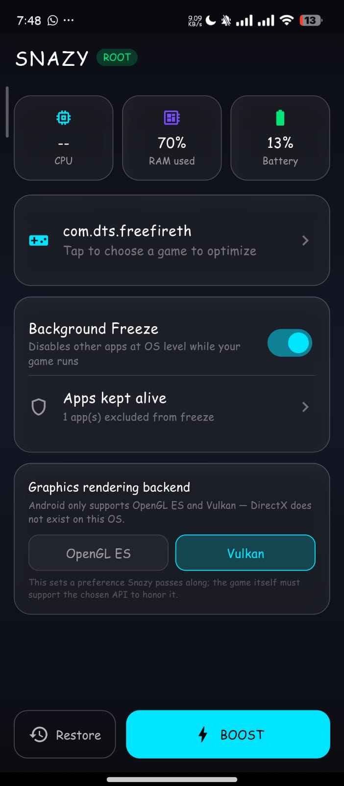
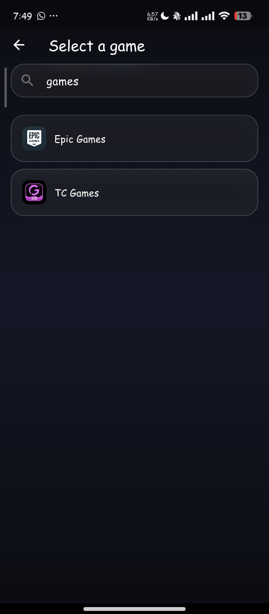
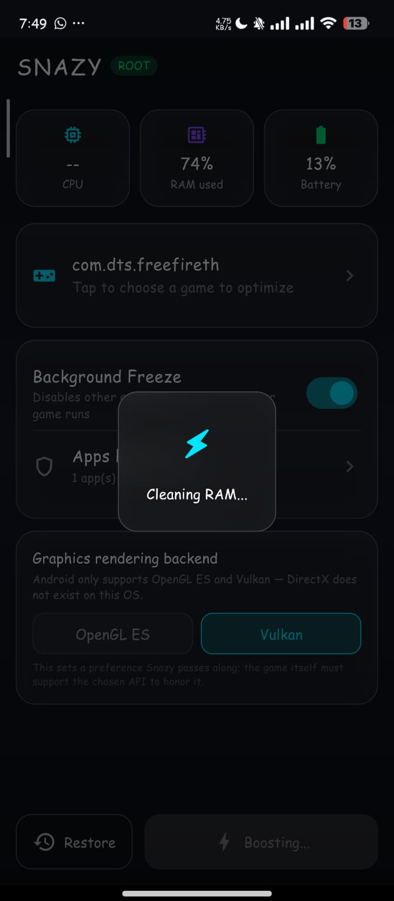

# Snazy Optimizer

<p align="center">
  
</p>

<h1 align="center">Snazy Optimizer</h1>

<p align="center">
  <strong>Android Gaming Performance Optimizer</strong>
</p>

<p align="center">
  Version 2.0.0 • Android 10+ • Root, Shizuku & Non-Root
</p>

<p align="center">
  <a href="https://github.com/sethikaDV/Snazy-optimizer-/releases">
    
  </a>
  <a href="https://github.com/sethikaDV/Snazy-optimizer-/releases">
    
  </a>
  <a href="https://github.com/sethikaDV/Snazy-optimizer-">
    
  </a>
  
</p>

---

# About Snazy Optimizer

Snazy Optimizer is an Android performance optimization application
designed for users who want a cleaner and more controlled gaming
environment.

The application provides different optimization paths depending on
whether the device has root access or is running in standard
non-root mode.

Snazy is designed to work with Android system capabilities instead
of pretending to provide system-level access that Android does not
allow to normal applications.

The goal is simple:

> Select your game, apply the available optimizations, and launch the
> game in an optimized environment.

---

# Version Information

| Property | Information |
|---|---|
| Application | Snazy Optimizer |
| Current Version | 2.0.0 |
| Platform | Android |
| Minimum Android | Android 10 |
| Minimum SDK | 29 |
| Target SDK | 34 |
| Framework | Flutter |
| Language | Dart / Kotlin |
| Application ID | `com.sethikadv.snazy` |
| Developer | SethikaDV |

---

# Screenshots

## Dashboard

<p align="center">
  
</p>

## Game Selection

<p align="center">
  
</p>

## Boosting Process

<p align="center">
  
</p>

# Features

| Feature | Root Mode | Shizuku Mode | Non-Root Mode |
|---|:---:|:---:|:---:|
| Game Selection | Yes | Yes | Yes |
| Game Launching | Yes | Yes | Yes |
| Optimization Profiles (Performance / Better / Normal / Ultra Battery Saver) | Yes | Yes | Normal only |
| CPU governor + max-clock unlock | Yes | Yes | No |
| GPU governor control (where exposed) | Yes | Yes | No |
| Background Freeze (force-stop, never disable) | Yes | Yes | Limited |
| Safe Apps (exclude from freeze) | Yes | Yes | Yes |
| Device Information | Yes | Yes | Yes |
| Restore Support | Yes | Yes | Yes |
| Android System Settings | Yes | Yes | Yes |

The exact capabilities available to the application depend on the
Android version, device manufacturer, permissions and whether root
or Shizuku access is available.

## Optimization Profiles

Snazy ships four profiles (root or Shizuku required, except Normal):

- **Performance** — every CPU core's governor set to `performance` and
  pinned to its own highest stock clock speed, plus the GPU governor
  where the chip exposes one. This is the fastest the hardware already
  supports — Android has no safe, generic way to push a chip past its
  own manufacturer limits, so that is never attempted.
- **Better** — CPU governor set to `performance` but capped below the
  absolute ceiling, so the device runs fast without sitting at max
  clock (and max heat) the whole time. GPU is left untouched.
- **Normal** — restores the exact governor/frequency values Snazy
  found the very first time it ran on the device (captured once,
  automatically) — a real factory baseline, not a guess.
- **Ultra Battery Saver** — governor set to `powersave` with CPU and
  GPU clocks pinned low for extended sessions.

## Shizuku Support (root-level access without rooting)

Devices without root can still use Performance/Better/Ultra Battery
Saver and full Background Freeze by granting
[Shizuku](https://shizuku.rikka.app) — an open-source tool that gives
an app the same shell-level access `adb` already has, without rooting
the device. Snazy includes an in-app setup guide (tap the **STANDARD**
badge on the dashboard, or open a locked profile) that walks through
installing Shizuku, starting it, and granting permission.

---

# Root Mode

When root access is available, Snazy Optimizer can use additional
Android system capabilities that are not normally available to
standard applications.

Root mode is intended for users who already have a properly configured
root environment.

Snazy does not attempt to root a device from inside the application.

The application detects available root access and uses the appropriate
optimization path.

### Root Mode Capabilities

Depending on the device and Android version, root mode can provide
access to operations such as:

- System-level optimization actions
- Application management
- Background application control
- Application freezing and restoring
- Additional performance-related operations
- More advanced device control

The availability of individual operations depends on the Android
environment.

---

# Non-Root Mode

Snazy Optimizer also supports devices without root access.

Android intentionally restricts third-party applications from
performing many system-level operations.

Because of these restrictions, non-root mode does not pretend to have
root privileges.

Instead, Snazy uses operations that are available to normal Android
applications and provides the user with the appropriate Android
system actions where required.

### Non-Root Mode

| Operation | Availability |
|---|---|
| Game selection | Available |
| Game launching | Available |
| Device information | Available |
| Supported optimization actions | Available |
| Root-only system modifications | Not available |
| Direct system-level app control | Restricted by Android |

---

# What Android Allows vs What Snazy Does

One of the important design principles of Snazy Optimizer is not to
claim functionality that Android itself does not permit.

| Requested Operation | Android Limitation | Snazy Approach |
|---|---|---|
| Grant root from the app | Android apps cannot root devices by themselves | Detect existing root access |
| DirectX rendering | DirectX is not the normal Android graphics API | Use supported Android graphics technologies |
| Kill arbitrary background apps | Restricted on modern Android | Use supported system mechanisms |
| Per-app CPU/RAM statistics | Restricted on modern Android | Use available device-level information |
| Freeze applications | Requires elevated access | Force-stops other apps' current process (root or Shizuku) — never disables them, so nothing needs re-enabling |
| Overclock CPU/GPU past factory limits | No safe, generic API on Android | Unlock the chip's own highest stock clock instead — real, verifiable, and hardware-safe |

This means Snazy focuses on real Android functionality rather than
fake optimization animations or simulated performance numbers.

---

# Game Optimization

Snazy Optimizer is designed around a simple gaming workflow.

```text
Open Snazy
     |
     v
Select Optimization Mode
     |
     v
Select Game
     |
     v
Apply Available Optimizations
     |
     v
Launch Game
